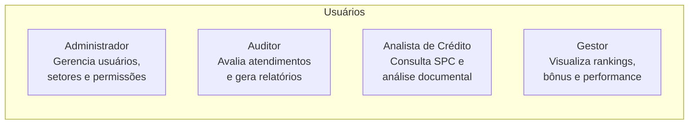
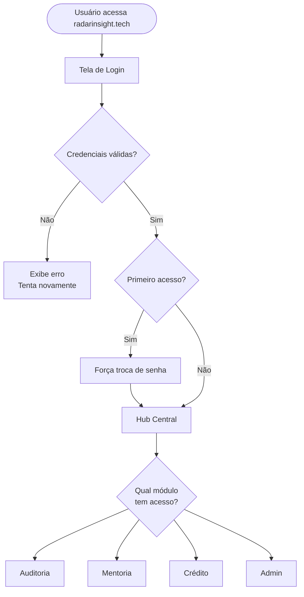
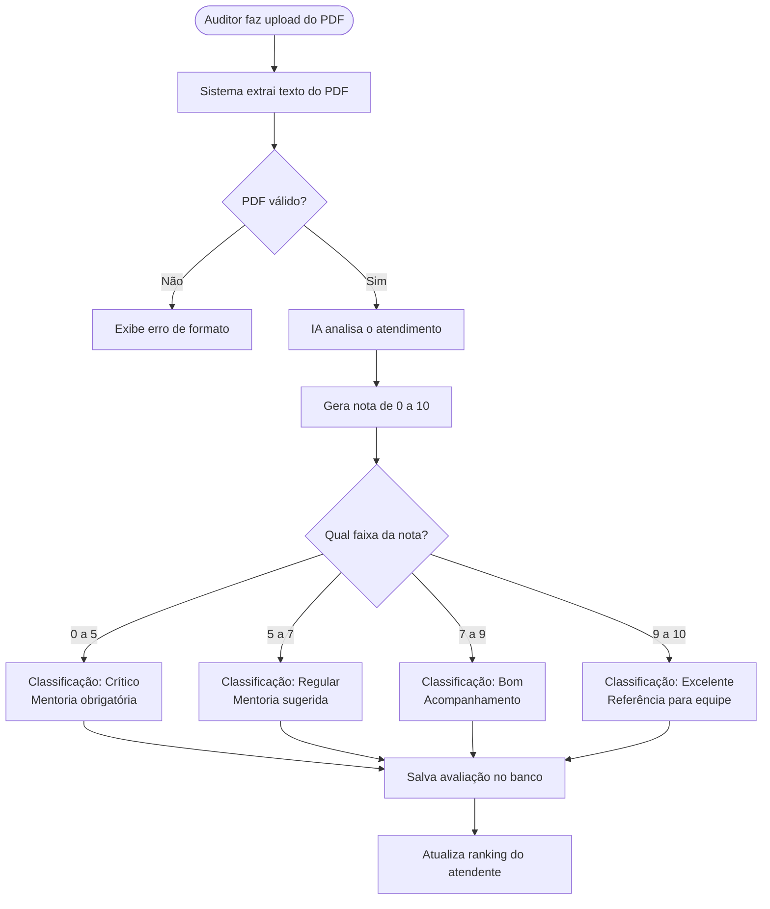
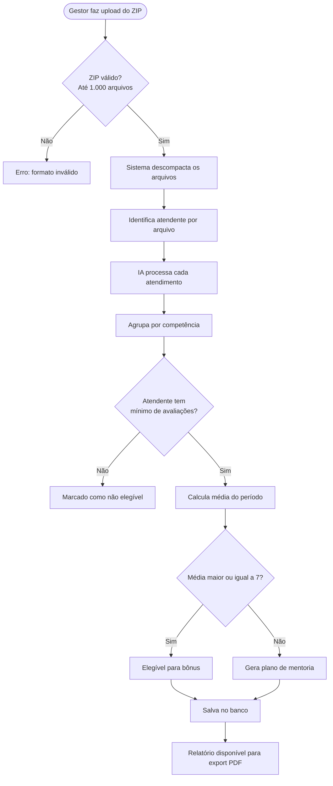
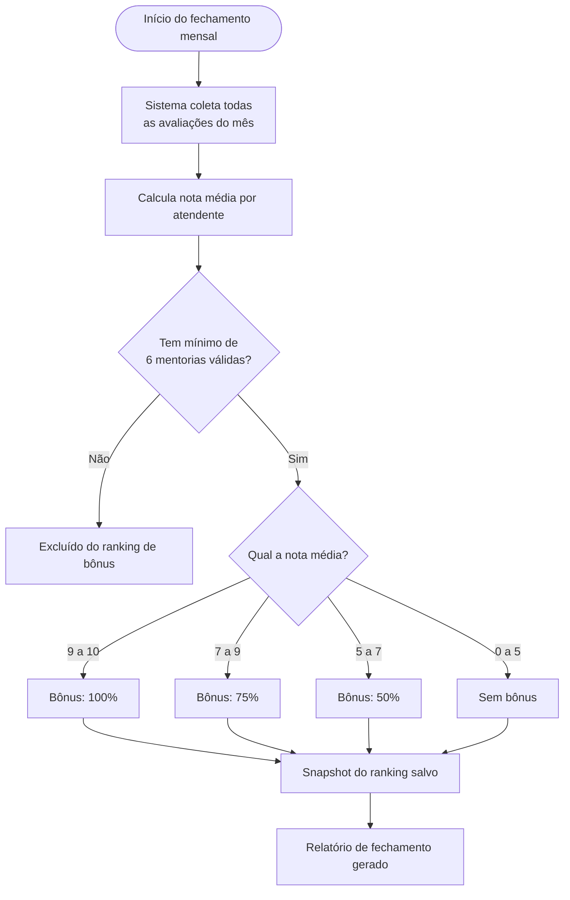
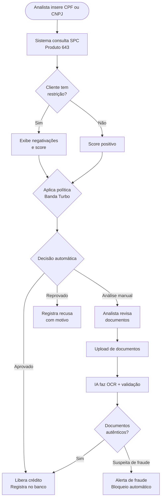
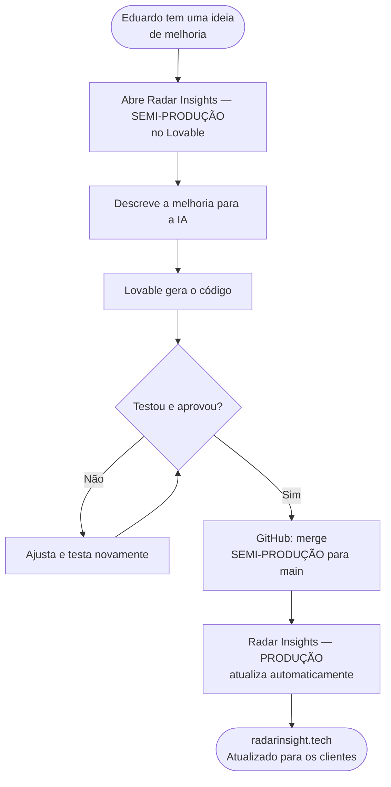
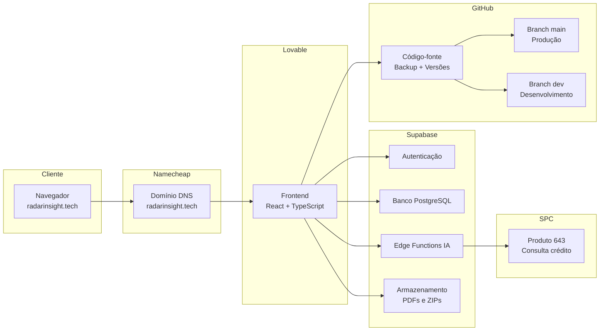

# Radar Insight Dashboard — Fluxograma Detalhado do Sistema

---

## Atores do Sistema

---

## Fluxo 1 — Autenticação

**Exemplo prático:**
> Eduardo cadastra um novo atendente no sistema. O sistema envia email com senha temporária. No primeiro login, o atendente é obrigado a criar uma senha nova antes de acessar qualquer módulo.

---

## Fluxo 2 — Auditoria de Atendimento

**Exemplo prático:**
> Auditor faz upload do PDF da chamada de Ana Santos do dia 15/03. A IA detecta que ela não seguiu o script de abertura e não ofereceu solução alternativa. Nota: 5,8 — Classificação: Regular. Sistema sugere mentoria sobre "Abordagem e Resolução".

---

## Fluxo 3 — Mentoria Lab (Lote)

**Exemplo prático:**
> No fechamento de março, gestor faz upload de um ZIP com 320 PDFs de atendimento. O sistema processa, identifica 12 atendentes, calcula as médias e detecta que 8 são elegíveis para bônus e 4 precisam de mentoria obrigatória antes do próximo ciclo.

---

## Fluxo 4 — Ranking e Bônus

**Exemplo prático:**
> No fechamento de março, João Silva teve média 8,4 com 7 mentorias válidas — elegível, bônus de 75%. Maria Costa teve média 9,1 com 8 mentorias — elegível, bônus de 100%. Pedro Alves teve média 7,2 mas apenas 4 mentorias — excluído do bônus.

---

## Fluxo 5 — Análise de Crédito

**Exemplo prático:**
> Analista consulta CPF 123.456.789-00. Sistema retorna score 720, sem negativações. Política Banda Turbo aprova automaticamente para crédito até R$ 5.000. Para valores acima, solicita upload de comprovante de renda — IA valida o documento e confirma autenticidade.

---

## Fluxo 6 — Deploy (Como uma melhoria chega à produção)

**Exemplo prático:**
> Eduardo quer adicionar um filtro por setor na tela de ranking. Abre o SEMI-PRODUÇÃO, descreve para o Lovable, testa com dados reais, aprova. Faz o merge no GitHub. Em minutos, o filtro está disponível em radarinsight.tech sem nenhuma interrupção para os clientes.

---

## Infraestrutura Completa

---

*Documento criado em: 2026-03-28*
*Versão: 1.0*
