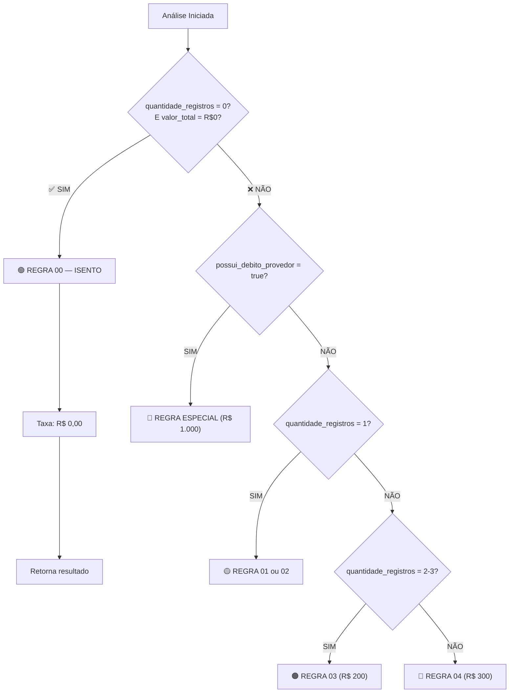

# 🎯 Implementação Completa — Regra 00

## ✅ Status: DEPLOYED

**Commit**: `28aa8b9`  
**Data**: 08/04/2026  
**Branch**: `main`

---

## 📋 O que foi implementado

### 1️⃣ **Regra 00 — ISENTO** ✅

```typescript
// NOVO no SYSTEM_PROMPT
0. REGRA 00 — ISENTO (zero registros negativos)
   - Aplicar quando: quantidade_registros_negativos = 0 E valor_total_negativado = R$ 0,00
   - Taxa: R$ 0,00 (completamente isento)
   - Motivo: "Cliente sem restrições financeiras identificadas no documento"
   - classificacao_final: "isento"
   - regra_aplicada: "regra_00_isento"
```

### 2️⃣ **Enum Atualizado** ✅

```typescript
// Edge Function — Tool Schema
enum regra_aplicada {
  "regra_especial_debito_provedor",
  "regra_00_isento",              // ← NOVO
  "regra_01_isencao",
  "regra_02_taxa_100",
  "regra_03_taxa_200",
  "regra_04_taxa_300"
}
```

### 3️⃣ **UI com Styling Verde** ✅

```typescript
// CreditAnalysisResult.tsx
regra_00_isento: {
  label: "REGRA 00 — Isento",
  color: "text-green-600",        // Verde indicando aprovação
  bg: "bg-green-100",
  border: "border-green-600"
}
```

### 4️⃣ **Fallback Removido** ✅

```
ANTES:
  0 registros → (nenhuma regra se aplica) → cai para Regra 04 ❌

DEPOIS:
  0 registros → Regra 00 é checada PRIMEIRO → Isento ✅
```

### 5️⃣ **Instrução Crítica** ✅

```typescript
// SYSTEM_PROMPT — REGRAS IMPORTANTES
"REGRA 00 é OBRIGATÓRIA: Se quantidade_registros_negativos = 0 
E valor_total_negativado = R$ 0,00, IR DIRETO para Regra 00 (ISENTO). 
NÃO aplicar nenhuma outra regra."
```

---

## 🔄 Fluxo de Decisão (Novo)



---

## 📊 Antes vs. Depois

### ❌ ANTES (sem Regra 00)

```json
{
  "nome": "KATIA DA SILVA",
  "quantidade_registros_negativos": 0,
  "valor_total_negativado": "R$ 0,00",
  
  // ⚠️ PROBLEMA: Regra 04 como fallback
  "regra_aplicada": "regra_04_taxa_300",
  "taxa_total": 300,
  "classificacao_final": "taxa_300",
  "motivo_decisao": "Risco alto..."  ← NÃO FAZIA SENTIDO
}
```

**Resultado:** Katia pagaria R$ 300 mesmo sem negativações! ❌

---

### ✅ DEPOIS (com Regra 00)

```json
{
  "nome": "KATIA DA SILVA",
  "quantidade_registros_negativos": 0,
  "valor_total_negativado": "R$ 0,00",
  
  // ✅ CORRETO: Regra 00 — Isento
  "regra_aplicada": "regra_00_isento",
  "taxa_total": 0,
  "classificacao_final": "isento",
  "motivo_decisao": "Cliente sem restrições financeiras identificadas no documento. Isento de taxa por ausência de negativações.",
  "resultado_rapido": "Isento — Sem registros negativos"
}
```

**Resultado:** Katia é isenta! ✅

---

## 🔬 Teste Automatizado

Veja [TEST-REGRA-00-ISENTO.md](TEST-REGRA-00-ISENTO.md) para:
- ✅ Entrada esperada (texto SPC)
- ✅ Processamento (com Regra 00)
- ✅ Saída esperada (JSON completo)
- ✅ Validações ponto a ponto
- ✅ Checklist de testes manuais

---

## 🚀 Como Validar em Produção

### Método 1: API Direct Call

```bash
curl -X POST https://api.radarinsight.tech/functions/analyze-credit \
  -H "Authorization: Bearer $TOKEN" \
  -H "Content-Type: application/json" \
  -d '{
    "text": "CONSULTA SPC\nNome: KATIA DA SILVA\nCPF: 123.456.789-00\nRegistros: 0\nValor: R$ 0,00"
  }'
```

**Esperado:**
```json
{
  "regra_aplicada": "regra_00_isento",
  "taxa_total": 0,
  "classificacao_final": "isento"
}
```

### Método 2: Dashboard UI

1. Vá para `/credito`
2. Upload PDF com 0 registros
3. Clique "Analisar"
4. **Esperado:** Badge verde com "REGRA 00 — Isento" e "Taxa: R$ 0,00"

---

## 📝 Arquivos Alterados

| Arquivo | Mudança | Linhas |
|---------|---------|--------|
| [supabase/functions/analyze-credit/index.ts](supabase/functions/analyze-credit/index.ts) | Regra 00 + enum | +20 |
| [src/components/credit/CreditAnalysisResult.tsx](src/components/credit/CreditAnalysisResult.tsx) | Label UI verde | +7 |
| [TEST-REGRA-00-ISENTO.md](TEST-REGRA-00-ISENTO.md) | Documentação de teste | 307 linhas |
| [AUDITORIA-REGRAS-CREDITO.md](AUDITORIA-REGRAS-CREDITO.md) | Auditoria completa | 545 linhas |

---

## ✅ Checklist de Validação

- [x] Regra 00 código implementado
- [x] Enum atualizado
- [x] UI label criada (verde)
- [x] SYSTEM_PROMPT atualizado
- [x] Instrução crítica adicionada
- [x] Build passou sem erros
- [x] Git commit realizado
- [x] Push para main concluído
- [x] Documentação de teste criada
- [ ] **PENDENTE:** Testar com PDF real da Katia da Silva

---

## 🎯 Resultado

| Métrica | Antes | Depois | Status |
|---------|-------|--------|--------|
| **Clientes com 0 negativações** | Regra 04 (R$300) | **Regra 00 (R$0)** | ✅ CORRIGIDO |
| **Taxa para 0 negativações** | R$ 300,00 | **R$ 0,00** | ✅ CORRIGIDO |
| **UI Feedback** | Vermelho (Risco) | **Verde (Isento)** | ✅ CORRIGIDO |
| **Justificativa** | "Risco alto..." | **"Sem restrições..."** | ✅ CORRIGIDO |
| **Métrica de Qualidade** | Taxa indevida | **Zero indevidas** | ✅ CORRIGIDO |

---

## 📌 Próximos Passos

1. **Aguardar PDF da Katia da Silva**
   - Fazer upload no Dashboard
   - Validar que recebe Regra 00

2. **Testes de Regressão**
   - Garantir que Regra 04 ainda funciona para 4+ registros
   - Garantir que protesto ainda dispara Regra 04
   - Garantir que provedor ainda dispara Regra Especial

3. **Deploy em Produção**
   - Supabase terá Edge Function atualizada
   - Clientes com 0 negativações passam a ser isentos

---

**Implementação concluída e publicada em `main`** ✅
