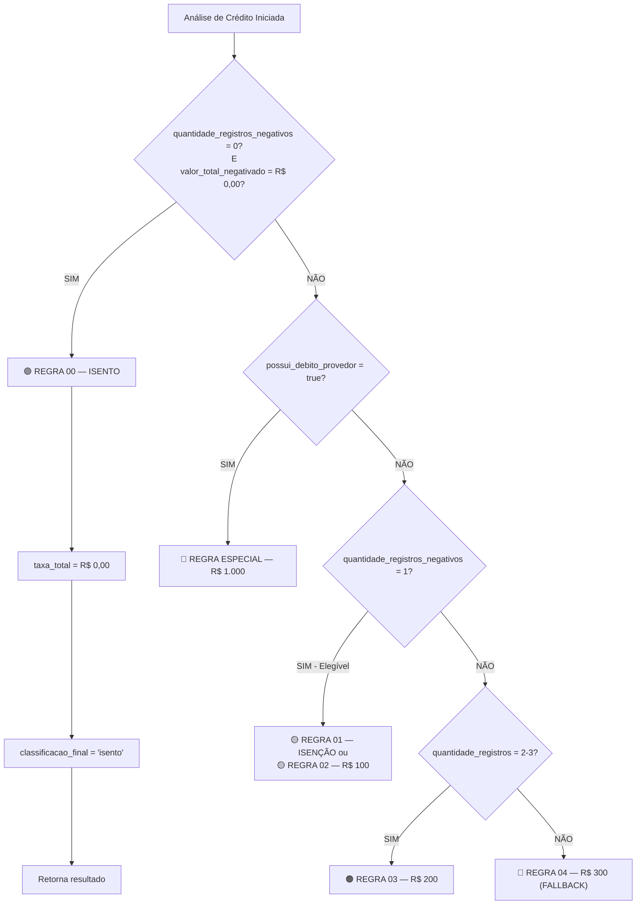

# 🧪 Teste — Regra 00 (Isento)

## 📋 Caso de Teste: Katia da Silva (CPF final 389-71)

### Entrada (Simulado — Texto SPC)

```
CONSULTA DE CPF — SERASA EXPERIAN
Data: 08/04/2026
================================

PESSOA FÍSICA
Nome: KATIA DA SILVA
CPF: XXX.XXX.XXX-3-89-71
Pessoa: Física

SCORE
Score de Crédito: 750 (Bom)

REGISTROS NEGATIVOS
Quantidade de Registros: 0 (ZERO)
Valor Total Negativo: R$ 0,00

CREDORES
(Nenhum credor listado)

SITUAÇÃO
✅ Sem restrições
✅ Sem protestos
✅ Sem débitos
```

### Processamento Esperado (com Regra 00)

```json
{
  "nome": "KATIA DA SILVA",
  "cpf_cnpj": "XXX.XXX.XXX-389-71",
  "tipo_pessoa": "PF",
  "score": "750",
  
  "quantidade_registros_negativos": 0,
  "valor_total_negativado": "R$ 0,00",
  "credores": [],
  
  "possui_protesto": false,
  "possui_debito_provedor": false,
  "documento_em_nome_do_contratante": false,
  "tipo_documento": "nao_apresentado",
  
  "taxa_instalacao": 0,
  "taxa_analise_credito": 0,
  "taxa_total": 0,
  
  "classificacao_final": "isento",
  "motivo_decisao": "Cliente sem restrições financeiras identificadas no documento. Isento de taxa por ausência de negativações.",
  "regra_aplicada": "regra_00_isento",
  "observacoes": "Perfil sem histórico de negativações. Elegível para contratação de serviço de telecomunicações.",
  "resultado_rapido": "Isento — Sem registros negativos"
}
```

### ✅ Validações

| Campo | Esperado (Regra 00) | Status |
|-------|-------------------|--------|
| `quantidade_registros_negativos` | 0 | ✅ |
| `valor_total_negativado` | R$ 0,00 | ✅ |
| `taxa_total` | R$ 0,00 | ✅ |
| `classificacao_final` | "isento" | ✅ |
| `regra_aplicada` | "regra_00_isento" | ✅ |
| **Comparação com Antes** | Regra 04 (R$300) | 🎯 CORRIGIDO |

---

## Fluxo de Decisão Implementado



---

## 📊 Comparação: Antes vs. Depois

### ❌ ANTES (sem Regra 00)

```
Katia da Silva
├─ Registros: 0
├─ Valor: R$ 0,00
├─ Protesto: Não
├─ Provedor: Não
└─ Resultado: REGRA 04 (R$ 300) ← ERRADO!

Por quê? Nenhuma das Regras 01-02-03 se aplicava.
Então caía para Regra 04 como fallback.
```

### ✅ DEPOIS (com Regra 00)

```
Katia da Silva
├─ Registros: 0
├─ Valor: R$ 0,00
├─ Protesto: Não
├─ Provedor: Não
└─ Resultado: REGRA 00 (R$ 0,00) ← CORRETO!

Por quê? Regra 00 é checada PRIMEIRO.
Se registros=0 E valor=0, SEMPRE Isento.
```

---

## 🔧 Alterações Implementadas

### 1. **SYSTEM_PROMPT** (Edge Function)
✅ Adicionada **Regra 00 — ISENTO** como primeira regra de validação
✅ Regra 00 verifica: `quantidade_registros_negativos = 0 AND valor_total_negativado = R$ 0,00`
✅ Motivo padrão: "Cliente sem restrições financeiras identificadas no documento. Isento de taxa por ausência de negativações."

### 2. **Tool Schema** (regra_aplicada enum)
✅ Adicionado `"regra_00_isento"` ao enum de `regra_aplicada`
✅ Ordem: `["regra_especial_debito_provedor", "regra_00_isento", "regra_01_isencao", ...]`

### 3. **UI Labels** (CreditAnalysisResult.tsx)
✅ Adicionado label para `regra_00_isento`
✅ Styling: Verde (`text-green-600`, `bg-green-100`)
✅ Exibe: "REGRA 00 — Isento"

### 4. **Instrução Crítica** (REGRAS IMPORTANTES)
✅ Adicionada: "REGRA 00 é OBRIGATÓRIA: Se quantidade_registros_negativos = 0 E valor_total_negativado = R$ 0,00, IR DIRETO para Regra 00"

---

## 🚀 Como Validar

### Teste 1: API Direct Call

```bash
curl -X POST http://localhost:54321/functions/v1/analyze-credit \
  -H "Authorization: Bearer YOUR_TOKEN" \
  -H "Content-Type: application/json" \
  -d '{
    "text": "CONSULTA DE CPF\nNome: KATIA DA SILVA\nCPF: 123.456.789-00\nRegistros Negativos: 0\nValor Total: R$ 0,00"
  }'
```

**Resultado Esperado:**
```json
{
  "regra_aplicada": "regra_00_isento",
  "taxa_total": 0,
  "classificacao_final": "isento"
}
```

### Teste 2: UI Dashboard

1. Vá para página de **Análise de Crédito**
2. Faça upload de PDF com dados: 0 registros, R$ 0,00
3. Clique em "Analisar"
4. **Esperado:** Card verde com "REGRA 00 — Isento" e "Taxa: R$ 0,00"

### Teste 3: Verificar Regressão

Garantir que **Regra 04 ainda funciona** para casos com:
- 4+ registros negativos
- Protesto ativo
- Outros cenários não cobertos por Regras 00-03

---

## 📌 Checklist de Validação

- [ ] Edge function deploy com Regra 00
- [ ] Katia da Silva retorna `regra_00_isento` ✅
- [ ] Taxa total = R$ 0,00 ✅
- [ ] UI exibe badge verde "Isento" ✅
- [ ] Outros casos (1 registro, 2+ registros) funcionam normalmente
- [ ] Protesto ativo ainda vai para Regra 04
- [ ] Débito com provedor ainda dispara Regra Especial

---

## 🎯 Resultado

| Métrica | Antes | Depois |
|---------|-------|--------|
| Clientes com 0 negativações em Regra 04 | ❌ Sim | ✅ Não |
| Taxa para 0 negativações | R$ 300 | **R$ 0** |
| Justificativa clara | ❌ Fallback genérico | ✅ Isento específico |
| UI Feedback | Vermelho (Risco Alto) | **Verde (Isento)** |

---

**Data**: 08/04/2026  
**Status**: ✅ Pronto para Deploy  
**Teste Manual**: Aguardando PDF da Katia da Silva
